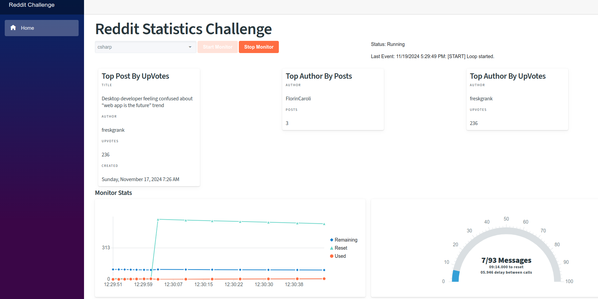

# Jack Henry coding challenge
Coding challenge for Jack Henry.  C# base SubReddit reader.

## Programming Assignment: 

Reddit, much like other social media platforms, provides a way for users to communicate their interests etc. For this exercise, we would like to see you build an application that listens to your choice of subreddits (best to choose one with a good amount of posts). You can use this link to help identify one that interests you.  We'd like to see this as a .NET/C# 6/7 application, and you are free to use any 3rd party libraries you would like.

Your app should consume the posts from your chosen subreddit in near real time and keep track of the following statistics between the time your application starts until it ends:

* Posts with most up votes
* Users with most posts

Your app should also provide some way to report these values to a user (periodically log to terminal, return from RESTful web service, etc.). If there are other interesting statistics you’d like to collect, that would be great. There is no need to store this data in a database; keeping everything in-memory is fine. That said, you should think about how you would persist data if that was a requirement. 


To acquire near real time statistics from Reddit, you will need to continuously request data from Reddit's rest APIs.  Reddit implements rate limiting and provides details regarding rate limit used, rate limit remaining, and rate limit reset period via response headers.  Your application should use these values to control throughput in an even and consistent manner while utilizing a high percentage of the available request rate.


It’s very important that the various application processes do not block each other as Reddit can have a high volume on many of their subreddits.  The app should process posts as concurrently as possible to take advantage of available computing resources. While we are only asking to track a single subreddit, you should be thinking about his you could scale up your app to handle multiple subreddits.

While designing and developing this application, you should keep SOLID principles in mind. Although this is a code challenge, we are looking for patterns that could scale and are loosely coupled to external systems / dependencies. In that same theme, there should be some level of error handling and unit testing. The submission should contain code that you would consider production ready.

When you're finished, please put your project in a repository on either GitHub or Bitbucket and send your recruiter link. Please be sure to provide guidance as to where the Reddit API Token values are located so that the team reviewing the code can replace/configure the value. After review, we may follow-up with an interview session with questions for you about your code and the choices made in design/implementation.

 
While the coding exercise is intended to be an interesting and fun challenge, we are interested in seeing your best work - aspects that go beyond merely functional code, that demonstrate professionalism and pride in your work.  We look forward to your submission!


### API Credentials
The application requires the Reddit API credentials to be added to the environment variables.
This is handled by creating a .env file in the .devcontainer folder.
The makefile can be used to create the template for this file.

```
make setup
```

This should create a file .devcontainers/.env with the following structure:
```json
REDDIT_CLIENT_ID=<Your ID>
REDDIT_CLIENT_SECRET=<Your Secret>
REDDIT_REDIRECT_URI=<Your URI>

```
___Note: While Reddit requires the Redirect URI to register the app, this application does not use it, as the communication is server side, and not on behalf of any user. ___


## Running the Application

For this exercise, I used a devcontainer within Visual Studio Code.
Prerequisites:
* Visual Studio Code (vscode)
    * Microsoft Remote Kit
* Docker

Once you clone the repository, open vscode in the root folder.
With the Remote container extension installed, vscode should prompt you to open in a devcontainer.

The devcontainer will load the extensions for the C# devkit.

Once the container is loaded, you should be able to hit F5 to run the software.

This will run in debug mode and should scroll the logs in the output, as well as open a browser to run the client.

### Release Pipeline

Had this been an actual project rather than an exercise, I would add a CI/CD pipeline to build the image and host it in a repository.  As this is an exercise, this step has been omitted.


## RedditChallenge Solution



The solution is a Blazor WASM client is hosted by a ASP.NET 7.0 server.

There is only one page in the app, and it runs on the home page.

The client allows the user to select a subreddit from a pre-defined list.  
Then click "Start Monitor" to run the loop.
The app will execute the Reddit API and pull the top 100 newest posts from the requested subbreddit.

### Post Statistics
There are 3 statistics that are shown:
* Top Post by Up Votes - This finds the post with the most up votes and displays the title/author/upvotes.
* Top Author by Posts - This finds the author in the dataset with the most posts.
* Top Author by Up Votes - This finds the author who has collected the most upvotes and displays them and their votes.

### Monitor Statistics
The application attempts to make the most use of the API rate limits.  Based upon the return headers, the app will attempt to implement a reasonable delay before calling the API again.

The home page displays 2 visualizations.  The first is a graph which tracks the Used requests, the Remaining requests and the Time (in seconds) until reset.

The second is a gauge that indicates similar information.  The number of requests made, the number remaining.  The label for the gauge also indicates the time until reset, and the current calculated delay.

## Solution Structure

The solution consists of 4 projects.

### RedditChallenge.Client

This is a Blazor application that runs the UI.  For the purposes of this application, I will used Radzen's Blazor library for UI elements.  I used Microsoft's base template for the demonstration.

The client is deployed as a WASM. It behaves as described above.

While I have also defined API endpoints for the server, for this client I have used SignalR to maintain websocket connections.
SignalR allows the server to push out updates.  That way each time the loop iterates, SignalR will broadcast the updated loop stats and the subreddit stats.


### RedditChallenge.Server

The server hosts the WASM client, provides API endpoints, and hosts the SignalR Hub.
While the SignalR hub is located in the Server project, most of the code is in the Shared library.


### RedditChallenge.Shared

The benefit of the C# WASM is that it can share the object definitions between the server and the client.  A similar benefit can be achieved with gRPC, however since I am usuing .net for both the client and the server, I can use a shared library.
All buisness rules will be in the Shared Project.

The shared project is organized as follows:
* Model
* Repositories
  * RedditAuthRepository - This performs the communication with Reddit for Authorization tokens.
  * SubredditRepository - This performs the communication with Reddit for Subreddit details.
* Services
  * ApiMonitor - This manages a rate limited loop that executes a provided function delegate and calculates a new delay based upon the results.  This emits events when the loop start,stops, or completes an iteration.
  * ApiRateLimiter - This handles the calculation for the delay.
  * RedditStatsService - This computes the statistics collected from the Subbreddit posts.  This emits an event when the stats have been updated

### RedditChallenge.SharedTests

This is a MS Test project that will run against the Shared Library for unit testing.


